# DPDP X-Ray

**An on-device privacy auditor for Android apps, built around India's Digital Personal Data Protection (DPDP) Act 2023.**

Point X-Ray at any app installed on your phone. It shows you:
- which tracking companies the app contacts;
- whether it does so **before** the user has agreed to anything;
- whether it **keeps doing it after the user says no**.

It reads the app's consent screen for dark patterns, cites the exact section of the law each problem breaks, gives you copy-paste code to fix it, and exports a PDF report.

Everything runs on the phone. No cloud service, no account, no upload: **0 bytes of audit data leave the device.**

<p align="center">
  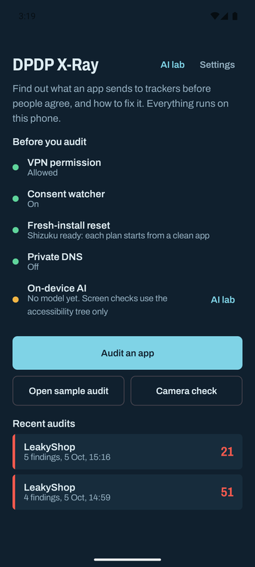
  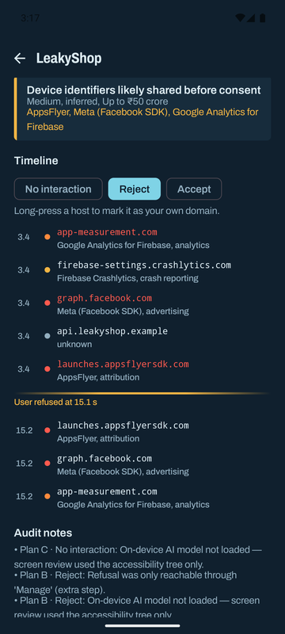
  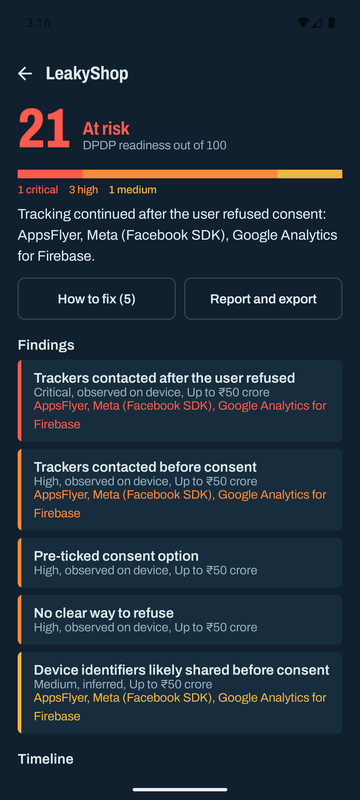
</p>

---

## Contents

- [Why this exists](#why-this-exists)
- [What X-Ray checks](#what-x-ray-checks)
- [Screenshots](#screenshots)
- [How an audit works](#how-an-audit-works)
- [Architecture](#architecture)
- [Getting started](#getting-started)
- [Using X-Ray](#using-x-ray)
- [The LeakyShop test app](#the-leakyshop-test-app)
- [On-device AI](#on-device-ai)
- [Privacy of X-Ray itself](#privacy-of-x-ray-itself)
- [Limitations](#limitations)
- [Roadmap](#roadmap)
- [Licence and attributions](#licence-and-attributions)

---

## Why this exists

The DPDP Act 2023 and the DPDP Rules 2025 make consent the centre of personal-data processing in India. Consent must be **free, specific, informed, unconditional and unambiguous, with a clear affirmative action** (Section 6(1)). It must also be as easy to withdraw as it was to give (Section 6(4)).

Most Android apps ship third-party SDKs (analytics, attribution, ads, crash reporting) that start talking to their servers the moment the app opens. That is often before any consent screen appears, and sometimes even after the user taps "Reject".

Developers rarely do this on purpose. An SDK's default `init()` call is usually enough. But nobody can see it happening:
- **Developers** can't see which SDKs phone home, or when.
- **Product and legal teams** get a consent banner from design, not proof that it works.
- **Users** have no way to tell whether "Reject" means anything.

Existing tools don't close the gap:
- Network proxies need a laptop, a certificate and an expert.
- Static scanners list SDKs but can't say *when* they fire relative to a consent choice.
- Cloud scanners upload the app and its traffic somewhere else.

X-Ray closes the gap on the phone itself. It plays the user: opens the app from a fresh install, refuses consent, accepts consent. It times every tracker contact against the exact moment of the choice, and explains each problem in plain language with the matching text of the law.

## What X-Ray checks

| Check | What it means | DPDP basis | Penalty ceiling |
|---|---|---|---|
| **C1** | Trackers contacted **before** any consent choice | s.4(1), s.6(1) | up to ₹50 crore |
| **C2** | Trackers contacted **after the user refused** | s.4(1), s.6(1) | up to ₹50 crore |
| **C3** | A consent option is pre-ticked | s.6(1), "clear affirmative action" | up to ₹50 crore |
| **C4** | No way to refuse, or refusal hidden behind "Manage" | s.6(1), s.6(4) | up to ₹50 crore |
| **C5** | One button bundles several purposes | s.6(1), Rule 3(b) | up to ₹50 crore |
| **C6** | The notice doesn't itemise the data or state the purpose | s.5(1), Rule 3(b) | up to ₹50 crore |
| **C7** | No visible way to withdraw consent | s.6(4), Rule 3(c) | up to ₹50 crore |
| **C8** | Notice offered only in English | s.5(3), s.6(3) | up to ₹50 crore |
| **C9** | Tracking in an app used by children | s.9(1), s.9(3) | **up to ₹200 crore** |
| **C10** | Ad or device IDs likely shared before consent (*inferred*) | s.6(1) | up to ₹50 crore |
| **NC** | No consent mechanism at all, yet trackers are contacted | s.5(1), s.6(1), s.6(10) | up to ₹50 crore |
| **V0** | Too few network lookups to judge, so the result is **inconclusive** (never "clean") | — | — |

Each finding is labelled either:
- **observed**: seen on the device during the audit;
- **inferred**: derived from SDK documentation or AI review.

All findings combine into a **DPDP readiness score** out of 100, with bands from *At risk* to *DPDP-ready*.

> Penalty ceilings are the statutory maximums in the DPDP Act Schedule, not predicted fines. X-Ray is a technical assessment tool, **not legal advice**.

## Screenshots

| Home and readiness checks | Pick the app to audit | Choose the audit plan |
|:---:|:---:|:---:|
|  | 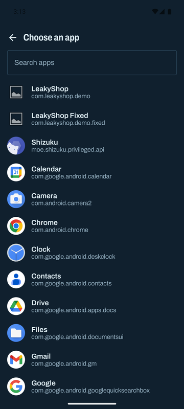 | 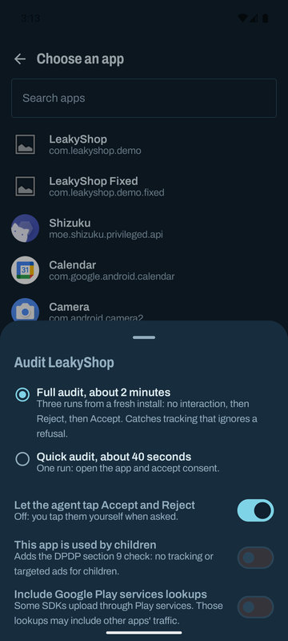 |
| Everything X-Ray needs (VPN, consent watcher, Shizuku, Private DNS, AI model) with one-tap fixes. | Any installed app, searchable. | **Full audit** (three runs from a fresh install) or **Quick audit** (one run). The agent can tap Accept and Reject for you. |

| Live timeline | Result | Finding detail |
|:---:|:---:|:---:|
|  |  | 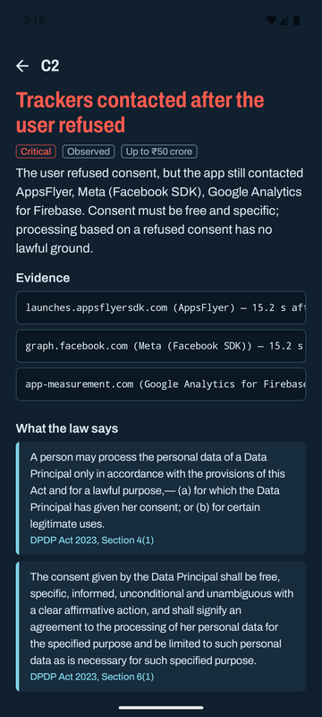 |
| Every tracker lookup is timed against the consent choice. Here the user refused at 15.1 s, and AppsFlyer, Meta and Google Analytics were contacted again 0.1 s later. | Score, severity bar, one-line summary and every finding with its evidence level and penalty ceiling. | The evidence (each host and when it was contacted), plus the **verbatim** DPDP text it breaks. |

| How to fix | Report | PDF export |
|:---:|:---:|:---:|
| 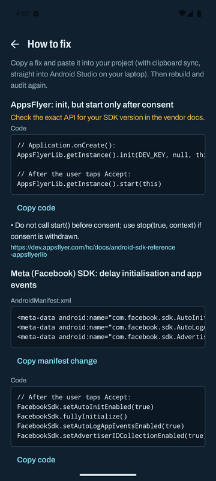 | 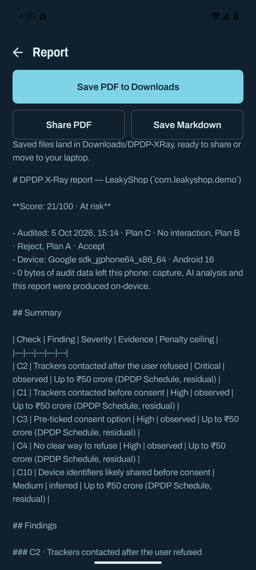 | 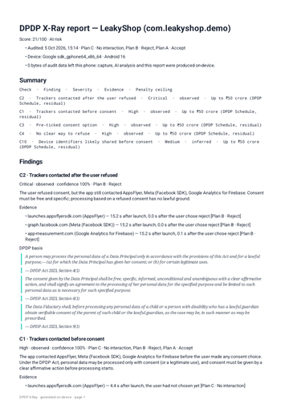 |
| SDK-specific code and manifest changes, ready to copy. | Markdown report with a summary table, findings, evidence and citations. | A shareable PDF saved to `Downloads/DPDP-XRay`. |

| A leaky consent screen | A compliant consent screen | After the fix |
|:---:|:---:|:---:|
| 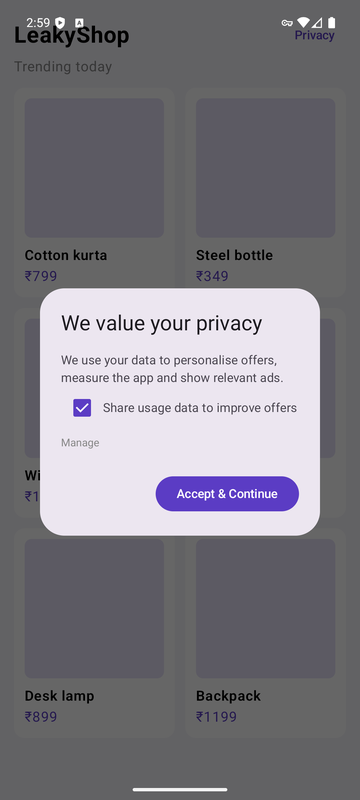 | 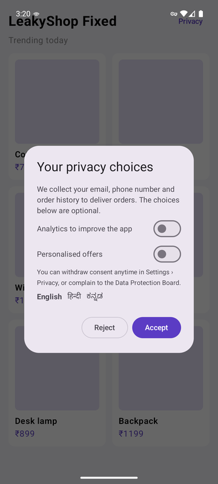 | 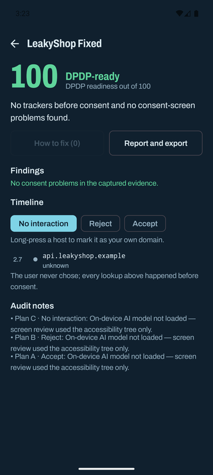 |
| Pre-ticked box, no Reject button (it's hidden behind "Manage"). | Equal Accept and Reject buttons, off-by-default toggles, withdrawal notice, three languages. | The same audit on the fixed app: **100, DPDP-ready**. |

## How an audit works

```
 ┌──────────────┐   pm clear (Shizuku)    ┌──────────────────────────┐
 │ Fresh install│ ──────────────────────▶ │ Per-app DNS capture (VPN) │
 └──────────────┘                         └────────────┬─────────────┘
                                                       │ every lookup, timestamped
 ┌──────────────────────────────┐                      ▼
 │ Consent watcher              │        ┌──────────────────────────┐
 │ (AccessibilityService)       │──────▶ │ Phase assigner            │
 │ • detects the consent screen │ taps,  │ before choice / after     │
 │ • reads the UI tree          │ times  │ accept / after refusal    │
 │ • takes a screenshot         │        └────────────┬─────────────┘
 │ • taps Reject / Accept       │                     │
 └──────────────┬───────────────┘                     ▼
                │ screenshot          ┌──────────────────────────────┐
                ▼                     │ Rules engine C1–C10, NC, V0  │
 ┌──────────────────────────────┐     │ + readiness score            │
 │ On-device Gemma (optional)   │───▶ └────────────┬─────────────────┘
 │ constrained-JSON screen review│                 ▼
 └──────────────────────────────┘     ┌──────────────────────────────┐
                                      │ Citations (BM25 + embeddings) │
                                      │ Fix catalogue · PDF/Markdown  │
                                      └──────────────────────────────┘
```

A **full audit** runs three plans, each from a clean install:

1. **No interaction:** open the app and don't touch anything. Shows what fires before the user even sees a choice.
2. **Reject:** refuse consent. If refusal is hidden behind "Manage", the agent opens it and refuses there, and records that refusal was hidden (C4). This run proves **C2**.
3. **Accept:** give consent. This is the baseline for what the app does with permission.

A **quick audit** runs one plan (open the app and accept) in about 40 seconds.

### The key technical ideas

- **Per-app DNS capture without root.**
  - X-Ray's `VpnService` routes only the target app (`addAllowedApplication`) and only a fake DNS server address through the tunnel.
  - Every DNS query is logged with a nanosecond timestamp, then forwarded to the real resolver through a protected socket.
  - Answers are rewritten to **TTL 0**, so Android never caches them and every new connection shows up as a fresh lookup.
  - No other traffic is touched, decrypted or stored.
- **Exact consent timing.**
  - The accessibility service watches the target app's window with a short trailing debounce.
  - It recognises consent screens with a multilingual lexicon (English, Hindi, Kannada), and records the precise moment of the Accept or Reject tap.
  - When the user taps by hand on a screen that doesn't report taps (for example Jetpack Compose), the choice is inferred when the dialog closes.
- **Fresh install every run.** Through [Shizuku](https://shizuku.rikka.app/), X-Ray runs `pm clear`, `am force-stop` and `am start` with shell privileges, with no root and no PC.
- **Observed facts win.**
  - Deterministic checks on the accessibility tree are merged with the AI's screenshot review.
  - When they disagree, the tree wins and the disagreement is shown, never hidden.
- **The law, verbatim.**
  - The relevant DPDP sections (s.4, 5, 6, 9, Rule 3 and the Schedule) ship with the app.
  - Each finding cites its own sections.
  - Free-text questions are answered by BM25 retrieval, optionally upgraded with EmbeddingGemma semantic search.

## Architecture

```
dpdp-xray/
├── core/        Pure Kotlin/JVM library: all the logic, fully unit-tested
├── app/         The Android app (Jetpack Compose)
└── leakyshop/   A small test app with "leaky" and "fixed" flavours
```

### `core/`: the auditing brain (no Android dependencies)

| Package | Responsibility |
|---|---|
| `model` | Audit plans, network events, consent events, screen audits, findings, scores |
| `dns` | DNS packet parsing, response building, SERVFAIL, TTL rewriting |
| `trackers` | Catalogue of 36 tracker families, including Indian SDKs such as CleverTap, MoEngage, WebEngage and InMobi, with categories (analytics, attribution, advertising, crash reporting…) |
| `consent` | Consent-screen lexicon in English, Hindi and Kannada |
| `audit` | Phase assigner: places each lookup before the choice, after accept, or after refusal |
| `screen` | UI-tree formatter, deterministic screen auditor, AI response parser, merge logic, the constrained-JSON prompt and schema |
| `rules` | Rules engine C1–C10, NC, V0 and the score calculator |
| `fixes` | Fix catalogue: SDK-specific code and manifest changes plus UI fixes |
| `dpdp` | Verbatim DPDP corpus, BM25 retriever, citation service |
| `report` | JSON and Markdown report generation |

**65 unit tests** cover the DNS codec, tracker matching, lexicon, phase assignment, every rule, screen auditing, fixes, citations and reports.

### `app/`: the Android side

| Package | Responsibility |
|---|---|
| `capture` | `XrayVpnService` (per-app DNS tunnel), `DnsForwarder`, `CaptureBus` |
| `consent` | `ConsentAccessibilityService`: consent detection, UI-tree mapping, screenshots, Accept/Reject taps |
| `control` | `ShizukuBridge` (clear, stop and start apps) and device readiness checks |
| `ai` | LiteRT-LM engine (Gemma) on GPU, CPU or NPU: screen review, plain-language explanations, EmbeddingGemma retrieval, benchmark |
| `audit` | `AuditOrchestrator`: runs the plans, coordinates capture, watcher, agent taps and AI, then produces the result |
| `data` | Audit history, settings, a clearly labelled sample audit |
| `report` | PDF rendering and export to Downloads or the share sheet |
| `ui` | Compose screens: home, app picker, live audit, results, finding detail, fixes, report, AI lab, camera check, settings |

### Tech stack

- **Language and UI:** Kotlin 2.4, Jetpack Compose (Material 3), kotlinx.serialization, coroutines.
- **On-device AI:** [LiteRT-LM](https://github.com/google-ai-edge/LiteRT-LM) running Gemma (screen review and explanations) and EmbeddingGemma (semantic legal search).
- **Privileged control:** [Shizuku](https://github.com/RikkaApps/Shizuku) API.
- **Platform APIs:** `VpnService`, `AccessibilityService` (including `takeScreenshot`), `PdfDocument`.
- **Build:** Android Gradle Plugin 9, compileSdk 37, minSdk 30 (Android 11+), targetSdk 36.

## Getting started

### Requirements

- An Android phone running **Android 11 or newer**. Arm64 is recommended; debug builds also run on the x86_64 emulator.
- To build from source: **JDK 17** and the **Android SDK** (platform 37, build-tools 36 or newer).
- Optional:
  - [Shizuku](https://shizuku.rikka.app/), for fresh-install resets and full audits.
  - A Gemma `.litertlm` model, for AI screen review and explanations.

### Build

```bash
git clone https://github.com/nitya-prakash-pandey-2005/dpdp-xray.git
cd dpdp-xray

./gradlew :core:test                 # run the 65 unit tests
./gradlew :app:assembleDebug         # build X-Ray
./gradlew :leakyshop:assembleLeakyDebug :leakyshop:assembleFixedDebug   # build the test apps
```

### Install

```bash
adb install app/build/outputs/apk/debug/app-debug.apk
adb install leakyshop/build/outputs/apk/leaky/debug/leakyshop-leaky-debug.apk
adb install leakyshop/build/outputs/apk/fixed/debug/leakyshop-fixed-debug.apk
```

### One-time phone setup

X-Ray's home screen lists every item under **Before you audit**, with a button to fix each one.

1. **VPN permission:** tap **Allow**. The VPN only carries DNS lookups for the app being audited.
2. **Consent watcher:** tap **Turn on**, then go to Accessibility, choose **DPDP X-Ray consent watcher**, and turn it on.
3. **Fresh-install reset** (recommended):
   - Install Shizuku and start it with Wireless debugging (everything happens on the phone; no PC needed).
   - Tap **Allow** in X-Ray.
   - Without Shizuku, quick audits still work.
4. **Private DNS:** set it to **Off** (Settings → Network → Private DNS). With it on, Android sends lookups over encrypted DNS that X-Ray can't see.
5. **On-device AI** (optional): see [On-device AI](#on-device-ai).

## Using X-Ray

1. **Audit an app:** pick the app, then choose:
   - **Full audit** (about 2 minutes; about 1 minute with *Fast audits* on);
   - **Quick audit** (about 40 seconds).
2. **Agent taps:**
   - Keep **Let the agent tap Accept and Reject** on to make the audit fully automatic.
   - Turn it off to tap the buttons yourself when asked.
   - Turn on **This app is used by children** to add the Section 9 check.
3. **Watch the live timeline:**
   - Each lookup appears with its time, company and category.
   - Trackers contacted before a choice, or after a refusal, turn red.
   - **Mark consent now** records a consent moment by hand for screens that expose no text, such as games or canvas-drawn UI.
4. **Read the result:**
   - The score and its band.
   - The findings, ordered by severity. Tap one to see the evidence, the exact DPDP text, and an on-device explanation in English or Hindi.
5. **How to fix:** copy the SDK-specific code or manifest change, rebuild, and audit again.
6. **Report and export:**
   - **Save PDF to Downloads**, **Share PDF**, or **Save Markdown**.
   - Files go to `Downloads/DPDP-XRay`.
7. **Camera check:** photograph or choose a screenshot of any consent screen, including one on another device, for an instant dark-pattern review.

Other tools:
- **Settings:**
  - *Presentation mode*: larger text for projectors and screen sharing.
  - *Fast audits*: shorter waits.
  - *Load AI when an audit starts.*
  - **Your own domains**: long-press a host on any timeline so your own backend is never counted as a tracker.
- **Open sample audit:** a complete, clearly labelled sample result, so you can explore the app before setting anything up.

## The LeakyShop test app

`leakyshop/` is a tiny shopping app built to exercise every check. It contains **no real SDKs**: it performs the same DNS lookups that AppsFlyer, the Meta SDK and Firebase Analytics make, and sends no data.

| Flavour | Behaviour | X-Ray result |
|---|---|---|
| **leaky** | Starts the "SDKs" on launch, pre-ticks a sharing box, hides Reject behind "Manage", and keeps tracking after refusal | **21, At risk**: C2 critical, plus C1, C3, C4 and C10 |
| **fixed** | Waits for consent, uses off-by-default toggles, gives Accept and Reject equal weight, offers three languages, explains withdrawal | **100, DPDP-ready** |

It is a safe, repeatable way to see each finding fire, and to check that the suggested fixes make them go away.

## On-device AI

X-Ray works without any model: screen checks then use the accessibility tree only. Adding a model enables:
- **AI screen review:** Gemma reads the consent screenshot and returns structured JSON (buttons, pre-ticked options, languages, dark patterns). That is merged with the tree facts.
- **Plain-language explanations** of each finding, in English or Hindi.
- **Semantic legal search** with EmbeddingGemma.
- **A benchmark** on CPU, GPU and NPU in the **AI lab**.

Copy model files into the app's models folder (no root needed):

```bash
adb push gemma-4-E2B-it.litertlm /sdcard/Android/data/com.dpdpxray.app/files/models/
```

- A file name containing `embed` is loaded as the embedding model.
- A Qualcomm NPU bundle (file name containing `npu` or the SoC id) enables the NPU backend.
- Models are not bundled; they're covered by the Gemma Terms of Use.

## Privacy of X-Ray itself

- **No uploads.** Capture, AI analysis and reports are all produced on the phone. Reports leave the device only when you share them.
- **DNS only.** The VPN carries DNS lookups for the one app under audit. X-Ray doesn't intercept, decrypt or store any other traffic.
- The `INTERNET` permission exists only to forward those DNS lookups to the real resolver.
- The accessibility service reads the target app's window only during an audit.
- There are no analytics, ads or crash-reporting SDKs in X-Ray.

## Limitations

- **DNS-level evidence.** X-Ray sees that an app *tried to contact* a tracker, not what it sent. Claims about payloads (for example advertising IDs) are always labelled *inferred*.
- **Hidden lookups.** Apps using their own DNS-over-HTTPS, hard-coded IPs, or long-lived connections can avoid fresh lookups. When too little is seen, X-Ray reports **inconclusive**, never "clean".
- **Legitimate uses.** Some processing may rely on a legitimate use under Section 7 rather than consent. X-Ray flags the technical behaviour; whether an exemption applies is a legal judgement.
- **Canvas-drawn UIs.** Some games and Flutter or Unity apps expose no accessibility text. Use **Mark consent now** together with the AI screenshot review.
- **Play services.** Some SDKs send data through Google Play services. The optional *Include Google Play services lookups* setting captures them, at the cost of also seeing other apps' Play traffic.

## Roadmap

- Payload-level evidence for debug builds the developer controls.
- A CI mode: run the rules engine against a capture file in a pull request.
- More languages for the consent lexicon and notices (Tamil, Telugu, Bengali, Marathi).
- Tracker catalogue updates from a signed, offline-verifiable list.
- Checks for consent-manager integrations and withdrawal flows deeper in app settings.

## Licence and attributions

- **Code:** [MIT License](LICENSE) © 2026 Nitya Prakash Pandey.
- **Archivo font:** SIL Open Font License 1.1 (Omnibus-Type).
- **LiteRT-LM** and the **Shizuku API**: Apache License 2.0.
- **Gemma models:** Gemma Terms of Use (not bundled).
- **DPDP Act 2023 and DPDP Rules 2025:** text from Government of India publications.

> X-Ray is a technical assessment tool. Its findings are not legal advice.
